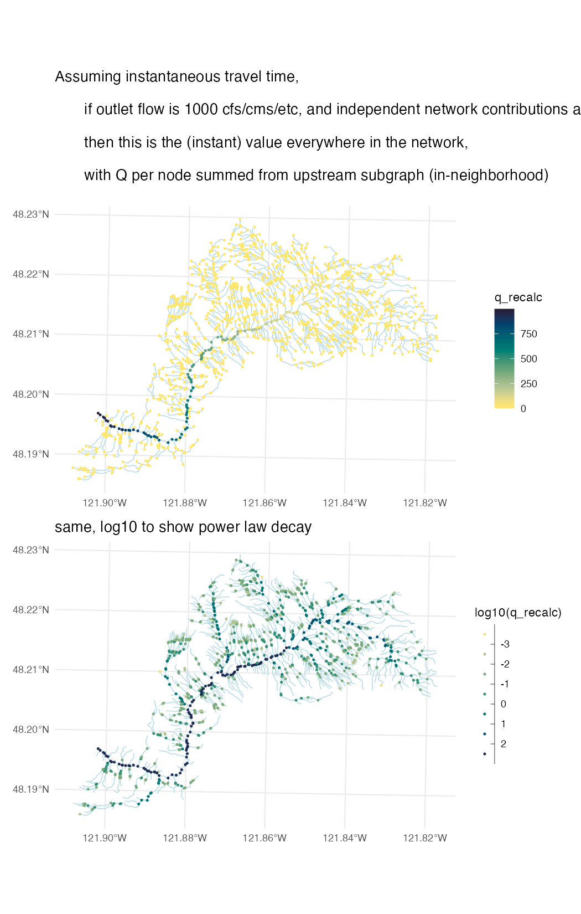

# test_nwm_3dhp

scratch space to examine coupling coarser scale flows to high res hydrography

Goal: Conceptually invert traditional basin modeling approaches that sum over drainage area pixels or reaches/subbasins to reach an outlet flow, instead taking NWM retrospective values as the outlet flow and ‘downscaling’ it back through (up into?) the contributing network. 

Alternative ideas to explore, in some sort of vaguely increasing order of complexity:

  - A: “Backwards travel time, topology” – a minimalist combo of network position and basic linework geometry, using topological and ground distance with a uniform expectation
    - initial scripting has gotten the 3DHP routed fairly easily into directed graphs that allow all sorts of fun graph theory things, but this seems like it would be mostly useful as a sort of null model baseline to compare against other more nuanced methods
  - B: “Backwards travel time, hydraulic geometry” – same as above, but attempting to add further topographic attributes as (linear?) weights so that the per-3DHP flowline values better reflects slopes and widths (channel, valley, hillslope)
  - C: “Backwards travel, full process” – building on 2, but somehow adding lithology and soils and land cover data to infer that within-NHDplus-catchment variation
  - D: “Nested ensembling (? No idea what to call this)” - something else entirely. it’s likely to be difficult to train any other class of model on observed flows (GAM, hierarchical Bayesian, deep learning, whatever), because of the lack of training data (i.e., multiple surface flow time series at a sub-NHDplus catchment scale), but maybe use a statistical ‘bridge’ model trained on a higher resolution process model
    - not a first priority 

2024-10-29 mvp of approach A 
